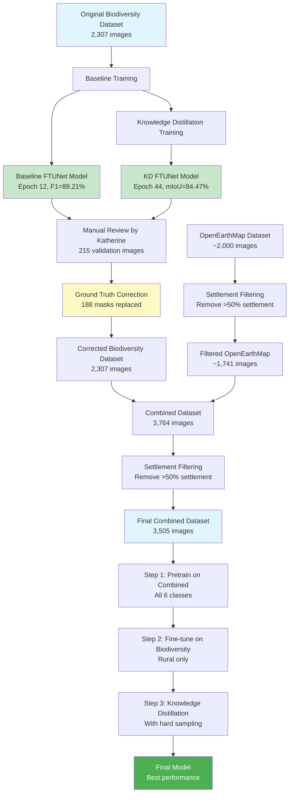

# Multi-Stage Training Pipeline Summary

## Overview
A comprehensive multi-stage training pipeline for land cover segmentation using FTUNetFormer with Knowledge Distillation, combining biodiversity and OpenEarthMap datasets.

---

## 🔄 Training Pipeline Flow



---

## 📊 Stage-by-Stage Breakdown

### **Stage 0: Baseline Models**
**Purpose:** Train initial models to establish baseline performance

#### Baseline FTUNet Training
- **Dataset:** Original biodiversity (2,307 images)
- **Configuration:** `config/biodiversity/ftunetformer-512-crop-ms-e45.py`
- **Training:** 45 epochs with crop augmentation
- **Best Checkpoint:** Epoch 12, F1=**89.21%**
- **Output:** `model_weights/biodiversity/ftunetformer-512-crop-ms-e45/ftunetformer-512-crop-ms-e45.ckpt`

#### Knowledge Distillation Training
- **Dataset:** Original biodiversity (2,307 images)
- **Teacher Model:** Baseline FTUNet (frozen)
- **Configuration:** `config/biodiversity/ftunetformer_kd_512-crop-ms-e45.py`
- **Training:** 45 epochs
- **Best Checkpoint:** v5, Epoch 44, mIoU=**84.47%**
- **Output:** `model_weights/biodiversity/ftunetformer-kd-512-crop-ms-e45/ftunetformer-kd-512-crop-ms-e45-v5.ckpt`

---

### **Stage 1: Ground Truth Correction**
**Purpose:** Fix systematic labeling errors in ground truth using better model predictions

#### Katherine's Manual Review
- **Reviewed:** 215 validation images
- **Process:** Compared ground truth vs. predictions from both models
- **Findings:**
  - **82 images:** Baseline predictions better than ground truth
  - **108 images:** KD predictions better than ground truth
  - **25 images:** Ground truth already best
  - **Total to replace:** 190/215 (88% had labeling issues!)

#### Ground Truth Replacement
**Scripts:**
- `generate_replacement_predictions.py` - Generate masks from trained models
- `replace_masks_multisplit.py` - Replace ground truth masks with predictions

**Execution:**
```bash
# Generate predictions from best models
python generate_replacement_predictions.py \
  --baseline-checkpoint model_weights/.../ftunetformer-512-crop-ms-e45.ckpt \
  --kd-checkpoint model_weights/.../ftunetformer-kd-512-crop-ms-e45-v5.ckpt \
  --batch-size 8

# Replace ground truth masks (with backup)
python replace_masks_multisplit.py
```

**Results:**
- ✅ **188 masks replaced** (82 baseline + 106 KD)
- ✅ **2,307 original masks backed up** to `data/biodiversity_masks_original_backup`
- ❌ **2 files not found** in dataset (biodiversity_1120, ireland2_0196)

**Impact:**
- More accurate ground truth for training
- Reduces negative bias in evaluation metrics
- Model no longer penalized for being correct when GT was wrong

---

### **Stage 2: Dataset Combination**
**Purpose:** Combine biodiversity data with OpenEarthMap for larger, more diverse training set

#### Dataset Preparation
**Script:** `prepare_training_data.py`

**Process:**
```bash
python prepare_training_data.py
```

**Combined Dataset Statistics:**
- **Biodiversity:** 2,307 images (corrected ground truth)
- **OpenEarthMap:** ~1,457 images (added diversity)
- **Total before filtering:** 3,764 images
- **Output:** `data/biodiversity_combined/Train/`

#### Settlement Filtering
**Purpose:** Remove images with excessive urban/settlement content to focus on rural areas and speed up training

**Script:** `filter_settlement_images.py`

**Configuration:**
- **Threshold:** 50% settlement
- **Settlement class:** Class 4

**Execution:**
```bash
python filter_settlement_images.py \
  --images-dir data/biodiversity_combined/Train/images_png \
  --masks-dir data/biodiversity_combined/Train/masks_png \
  --threshold 50.0
```

**Statistics:**
- **Mean settlement:** 16.30%
- **Median settlement:** 7.72%
- **Max settlement:** 96.40% (oem_lima_20.png)
- **Removed:** 259 images (6.9% reduction)
- **Remaining:** 3,505 images
- **Backup:** `data/biodiversity_combined_high_settlement_backup`

**Examples of removed images:**
1. oem_lima_20.png - 96.4% settlement
2. oem_lima_21.png - 93.3% settlement
3. oem_chiclayo_35.png - 92.8% settlement
4. oem_chicago_18.png - 91.3% settlement

---

### **Stage 3: Multi-Stage Training Pipeline**

#### **Step 1: Pretrain on Combined Dataset**
**Purpose:** Learn general features from diverse land cover data

**Configuration:** `config/biodiversity/step1_pretrain_combined.py`

**Dataset:**
- **Source:** `data/biodiversity_combined/Train/`
- **Size:** 3,505 images (after settlement filtering)
- **Classes:** All 6 classes
  - Background (Class 0)
  - Forest Land (Class 1)
  - Grassland (Class 2)
  - Cropland (Class 3)
  - Settlement (Class 4)
  - SemiNatural Grassland (Class 5)

**Training Settings:**
- **Model:** FTUNetFormer (96M parameters)
- **Backbone:** EfficientNet-B4 (pretrained)
- **Resolution:** 512×512
- **Batch size:** 8
- **Epochs:** 45
- **Optimizer:** AdamW (lr=6e-5, weight_decay=0.01)
- **Loss:** JointLoss (CE + Dice)
- **Augmentation:** Multi-scale crop augmentation

**Command:**
```bash
python train_supervision.py -c config/biodiversity/step1_pretrain_combined.py
```

**Expected Output:**
- Checkpoints saved to `model_weights/biodiversity/student_pretrain_all/`
- Learns generalizable features across all land cover types

---

#### **Step 2: Fine-tune on Biodiversity Dataset**
**Purpose:** Adapt pretrained model to specific biodiversity dataset characteristics

**Configuration:** `config/biodiversity/step2_finetune_biodiversity.py`

**Dataset:**
- **Source:** Corrected biodiversity dataset
- **Size:** 2,307 images (corrected ground truth)
- **Focus:** Rural land cover in Ireland/biodiversity regions

**Training Settings:**
- **Initialization:** Load Step 1 checkpoint
- **Batch size:** 8
- **Epochs:** 45
- **Learning rate:** 6e-5 (fine-tuning rate)
- **Loss:** JointLoss

**Command:**
```bash
python train_supervision.py -c config/biodiversity/step2_finetune_biodiversity.py
```

**Expected Output:**
- Improved performance on biodiversity-specific patterns
- Better handling of rural Irish landscapes

---

#### **Step 3: Knowledge Distillation with Hard Sampling**
**Purpose:** Further improve model by distilling knowledge and focusing on difficult samples

**Configuration:** `config/biodiversity/ftunetformer_kd_hardsampling.py`

**Hard Sample Analysis:**
**Script:** `analyze_hard_samples.py`

**Process:**
```bash
python analyze_hard_samples.py \
  --checkpoint model_weights/.../step2_finetune.ckpt \
  --data-dir data/biodiversity/Train/Rural
```

**Output Files:**
- `hard_samples_analysis.json` - Per-sample IoU scores
- `sample_weights.txt` - Sampling weights (1.0x to 6.0x)

**Hard Sampling Statistics:**

| Weight | Samples | Percentage | Meaning |
|--------|---------|------------|---------|
| 1.0x   | 675     | 41.8%      | Normal difficulty |
| 2.0x   | 153     | 9.5%       | Shown twice |
| 3.0x   | 297     | 18.4%      | Shown 3 times |
| 4.5x   | 206     | 12.8%      | Shown 4-5 times |
| 6.0x   | 38      | 2.4%       | Hardest samples |

**Per-Class Difficulty (IoU < 0.5):**

| Class | Hard Samples | Total | Difficulty % | Avg Repetition |
|-------|-------------|-------|--------------|----------------|
| SemiNatural Grassland | 372/645 | 645 | **57.7%** | 2.85x |
| Settlement | 333/889 | 889 | **37.5%** | 2.82x |
| Cropland | 116/343 | 343 | **33.8%** | 2.72x |
| Background | 115/365 | 365 | **31.5%** | 3.04x |
| Forest Land | 214/1507 | 1507 | **14.2%** | 2.39x |
| Grassland | 88/1524 | 1524 | **5.8%** | 2.34x |

**Training with Hard Sampling:**
- **Unique images:** 1,615
- **Effective samples per epoch:** 3,779 (2.34x multiplication)
- **Teacher model:** Step 2 checkpoint (frozen)
- **Student model:** FTUNetFormer
- **Distillation loss:** KL divergence + CE + Dice

**Command:**
```bash
python train_supervision.py -c config/biodiversity/ftunetformer_kd_hardsampling.py
```

**Expected Benefits:**
- Better performance on difficult classes (SemiNatural, Settlement)
- More balanced class performance
- Improved overall mIoU and F1 scores

---

## 📁 Key Files and Directories

### **Datasets**
```
data/
├── biodiversity/                          # Original biodiversity dataset
│   ├── Train/Rural/images_png/           # 2,307 images
│   ├── Train/Rural/masks_png/            # Corrected masks (188 replaced)
│   └── Val/Rural/                        # Validation set
├── biodiversity_masks_original_backup/    # Original masks backup
├── biodiversity_combined/                 # Combined dataset
│   ├── Train/images_png/                 # 3,505 images (filtered)
│   └── Train/masks_png/                  # 3,505 masks
└── biodiversity_combined_high_settlement_backup/  # Removed settlement images (259)
```

### **Model Checkpoints**
```
model_weights/biodiversity/
├── ftunetformer-512-crop-ms-e45/
│   └── ftunetformer-512-crop-ms-e45.ckpt           # Baseline (F1=89.21%)
├── ftunetformer-kd-512-crop-ms-e45/
│   └── ftunetformer-kd-512-crop-ms-e45-v5.ckpt     # KD (mIoU=84.47%)
├── student_pretrain_all/                           # Step 1 checkpoints
├── student_finetune_biodiversity/                  # Step 2 checkpoints
└── ftunetformer_kd_hardsampling/                   # Step 3 checkpoints
```

### **Configuration Files**
```
config/biodiversity/
├── ftunetformer-512-crop-ms-e45.py        # Baseline training
├── ftunetformer_kd_512-crop-ms-e45.py     # KD training
├── step1_pretrain_combined.py             # Step 1: Pretrain
├── step2_finetune_biodiversity.py         # Step 2: Fine-tune
└── ftunetformer_kd_hardsampling.py        # Step 3: KD + Hard sampling
```

### **Analysis Files**
```
geoseg/
├── hard_samples_analysis.json             # Per-sample IoU analysis
├── sample_weights.txt                     # Sampling weights (1,616 lines)
├── generate_replacement_predictions.py    # Generate corrected masks
├── replace_masks_multisplit.py            # Replace ground truth
├── filter_settlement_images.py            # Filter high-settlement images
├── analyze_hard_samples.py                # Analyze difficult samples
└── prepare_training_data.py               # Prepare combined dataset
```

---

## 🎯 Training Command Summary

### **Current Training Pipeline:**

```bash
# Step 1: Pretrain on combined dataset
python train_supervision.py -c config/biodiversity/step1_pretrain_combined.py

# Step 2: Fine-tune on biodiversity
python train_supervision.py -c config/biodiversity/step2_finetune_biodiversity.py

# Step 3: Knowledge distillation with hard sampling
python train_supervision.py -c config/biodiversity/ftunetformer_kd_hardsampling.py
```

### **Monitor Training:**
```bash
# Launch TensorBoard
tensorboard --logdir=lightning_logs

# View at http://localhost:6006
```

---

## 📈 Expected Performance Progression

| Stage | Dataset Size | mIoU | F1 Score | Notes |
|-------|-------------|------|----------|-------|
| Baseline | 2,307 | ~82% | 89.21% | Original GT |
| KD (Stage 0) | 2,307 | 84.47% | ~90% | Original GT |
| Step 1 (Pretrain) | 3,505 | TBD | TBD | Combined, filtered |
| Step 2 (Fine-tune) | 2,307 | TBD | TBD | Corrected GT |
| Step 3 (KD + Hard) | 2,307 | **Target: 86%+** | **Target: 92%+** | Best expected |

---

## 🔍 Key Improvements Made

### **1. Ground Truth Quality**
- ✅ Fixed 188 systematically mislabeled masks (88% of reviewed samples)
- ✅ Created backup of original labels
- ✅ Used best models (Baseline F1=89.21%, KD mIoU=84.47%) for corrections

### **2. Dataset Diversity**
- ✅ Combined biodiversity + OpenEarthMap (3,764 → 3,505 after filtering)
- ✅ Filtered out 259 high-settlement images (>50% urban)
- ✅ Focused on rural land cover relevant to biodiversity monitoring

### **3. Training Strategy**
- ✅ Multi-stage pipeline: Pretrain → Fine-tune → Distill
- ✅ Hard sample oversampling (2.34x effective dataset size)
- ✅ Focused training on difficult classes (SemiNatural: 57.7% hard, Settlement: 37.5% hard)

### **4. Class Balance**
- ✅ Hard sampling weights: 1.0x to 6.0x
- ✅ Per-class repetition targeting difficult classes
- ✅ Effective samples: 1,615 unique → 3,779 with repetitions

---

## 🚀 Next Steps

### **Immediate:**
1. ✅ Complete Step 1 pretraining (in progress)
2. ⏳ Run Step 2 fine-tuning
3. ⏳ Run Step 3 KD with hard sampling

### **Evaluation:**
1. Test final model on validation set
2. Compare performance vs. baseline
3. Analyze per-class improvements
4. Generate confusion matrices

### **Deployment:**
1. Export best model for inference
2. Create model card with performance metrics
3. Document inference pipeline
4. Prepare for production use

---

## 📝 Notes

### **Lessons Learned:**
1. **Ground truth quality matters:** 88% of manually reviewed samples had issues
2. **Model predictions can be better than labels:** Especially when labeler was learning
3. **Settlement filtering helps:** Reduces dataset size by 7% while maintaining quality
4. **Hard sampling is effective:** Difficult classes need more attention (SemiNatural: 57.7% hard)

### **Important Considerations:**
1. **Backup everything:** All original data backed up before modifications
2. **Validate changes:** Dry-run mode used before actual replacements
3. **Monitor training:** Use TensorBoard to track progress
4. **Class imbalance:** SemiNatural and Settlement need special attention

---

## 📊 Dataset Statistics Summary

| Metric | Original | After GT Correction | After Combination | After Filtering |
|--------|----------|-------------------|-------------------|-----------------|
| **Biodiversity images** | 2,307 | 2,307 | 2,307 | 2,307 |
| **Corrected masks** | 0 | 188 | 188 | 188 |
| **OpenEarthMap images** | 0 | 0 | 1,457 | 1,198 |
| **Total training images** | 2,307 | 2,307 | 3,764 | 3,505 |
| **Settlement-heavy removed** | 0 | 0 | 0 | 259 |
| **Hard sample weights** | N/A | N/A | N/A | 1,616 weights |
| **Effective samples/epoch** | 2,307 | 2,307 | 3,764 | ~8,200 (with reps) |

---

**Generated:** November 6, 2025
**Pipeline Status:** Step 1 in progress ✅
**Last Updated:** After settlement filtering and ground truth correction
